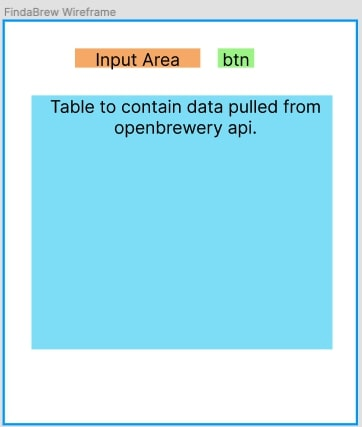

# FindaBrew
---
A simple web app that displays a table of breweries with some of their information using the openbrewerydb.

## Technologies Used
---
+ HTML5
+ CSS3
+ JavaScript
+ jQuery
+ Google Fonts
+ fontAwesome
+ openbrewerydb

## WireFrame
---

---
## Future Enhancements
---
+ Auto populate table with geolocation of user then allow them to modify search with input
+ Utilize a web scraper or some other way of grabbing brewery logo off their site to have that image with the brewery information
+ Map showing pins around area of location of breweries
+ Ability to mark brewery as visited to drop it to bottom of table/hide it 
+ filter by name,distance(geolocation)
+ Popup/out CSS cards w/ brewery information
+ Beers on tap via a webscraper
+ Adding socials to CSS cards
