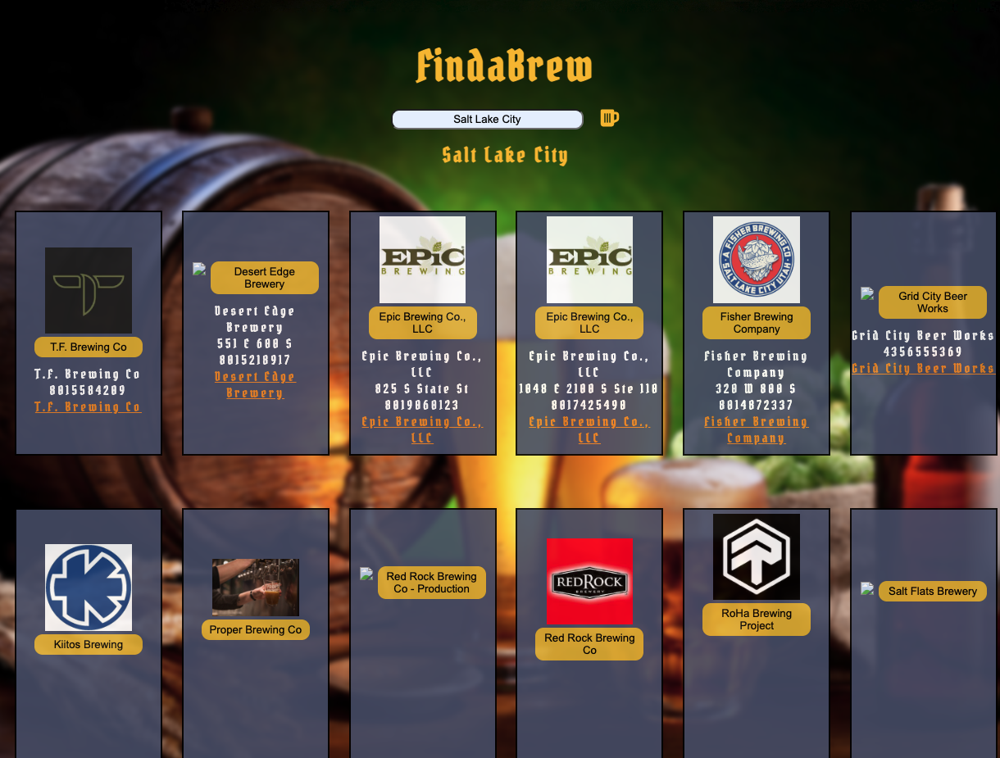

# FindaBrew
---
A web app that displays cards of breweries with their information using the openbrewerydb.

## Technologies Used
---
+ HTML5
+ CSS3
+ JavaScript
+ jQuery
+ Google Fonts
+ fontAwesome
+ openbrewerydb
+ clearbit

## Screenshot
---

---
##Site Link

https://finadabrew.netlify.app/
---
## Future Enhancements
---
+ Auto populate table with geolocation of user then allow them to modify search with input
+ Map showing pins around area of location of breweries
+ Ability to mark brewery as visited to drop it to bottom of hide it 
+ filter by name,distance(geolocation)
+ Beers on tap via a webscraper
+ Adding socials to CSS cards
